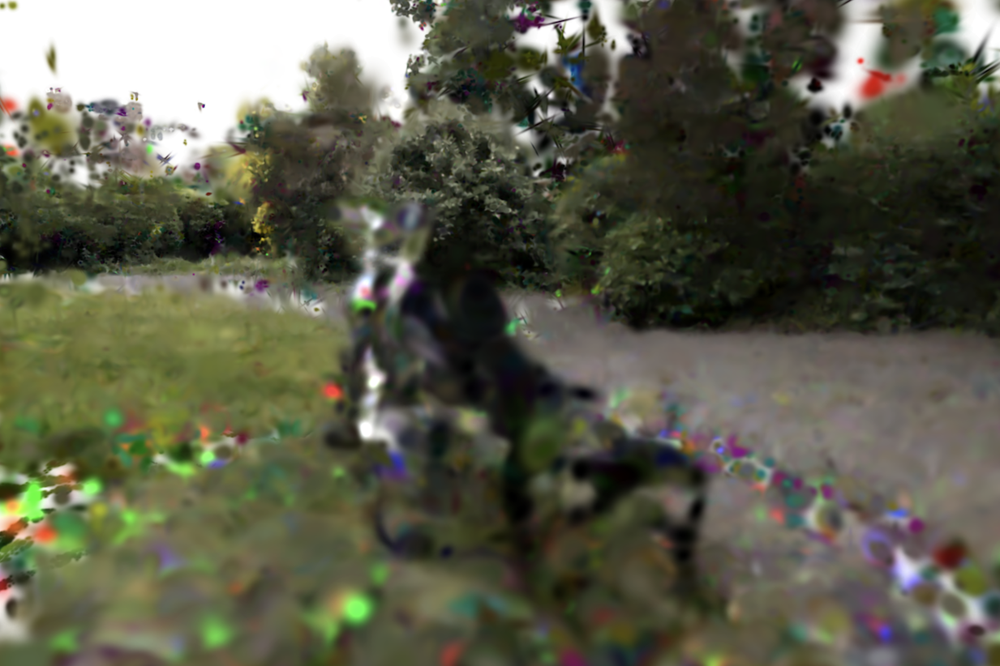
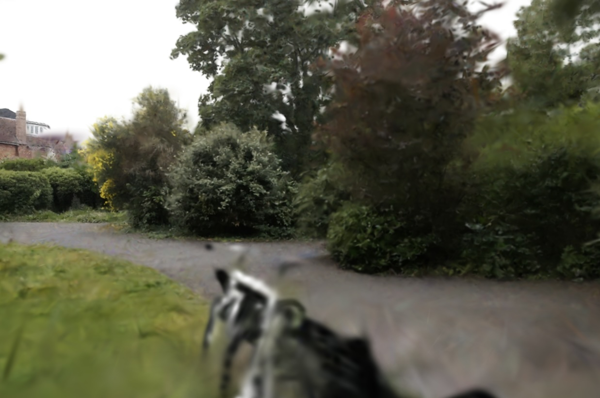

# 3D Gaussian Splatting on Apple Silicon

A from-scratch implementation of [3D Gaussian Splatting](https://repo-sam.inria.fr/fungraph/3d-gaussian-splatting/) in Metal/C++ for macOS. This project implements the complete training pipeline including tiled rasterization, differentiable rendering, and adaptive density control, entirely on GPU using Apple's Metal framework.

**This is not a port or wrapper.** Every component was implemented directly in Metal shaders and C++, providing deep insight into the algorithm's internals and the challenges of real-time neural rendering.

## Motivation

This project was undertaken as an exploratory deep-dive into 3D Gaussian Splatting, one of the most significant advances in neural rendering from 2023. Rather than using the official PyTorch/CUDA implementation, I chose to reimplement the entire pipeline from scratch in Metal to:

1. **Gain deep algorithmic understanding**
2. **Explore Apple Silicon for ML/graphics**
3. **Develop debugging intuition**

## Future Work

- [ ] Implement degree-3 spherical harmonics for view-dependent effects
- [ ] Debug and enable GPU radix sort for faster training
- [ ] Add anti-aliasing (EWA splatting) for distant Gaussians
- [ ] Investigate backward pass gradient accuracy
- [ ] Profile and optimize Metal shader occupancy

## Results

### Bicycle Scene (MipNeRF360)

| Metric | This Implementation | Original 3DGS |
|--------|---------------------|---------------|
| PSNR | 14.15 dB (mean) / 21.34 dB (best) | 25.25 dB |
| SSIM | 0.280 (mean) / 0.537 (best) | 0.771 |
| LPIPS ↓ | 0.865 (mean) / 0.579 (best) | - |
| Final Loss | 0.1276 | - |
| Training Time | 510 min | ~6 min |
| Final Gaussians | 1,000,000 | - |
| Initial Gaussians | 54,275 | - |

<details>
<summary>Training Convergence</summary>

```
Training: 155 epochs (~30K iterations) on 194 images
Optimizer: Adam with per-parameter learning rates

Loss progression:
  Epoch 0:   0.2628 (initial)
  Epoch 50:  0.1892
  Epoch 100: 0.1456
  Epoch 155: 0.1276 (final)

Opacity resets at iterations: 3000, 6000, 9000, 12000
Loss reduction: 51.4%
```

</details>

### Comparison with Original Implementation

| Method | PSNR | SSIM | Training Time | Hardware |
|--------|------|------|---------------|----------|
| Original 3DGS (CUDA) | 25.25 | 0.771 | ~6 min | NVIDIA RTX 3090 |
| This Implementation | 14.15 | 0.280 | 510 min | Apple M1 Pro |

### Analysis of Performance Gap

The quality gap between this implementation and the original is expected and instructive:

1. **SH Degree**: This implementation uses only DC terms (degree-0 SH) vs. degree-3 in the original. Higher-order SH captures view-dependent effects critical for specular surfaces like the bicycle frame. Implementing higher-order SH requires a significant speed up in both the forward and backward passes due to the time required for including view-direction dependent evaluation and corresponding gradient computation. Using DC-only was a practical tradeoff that still demonstrates the core algorithm. This explains why peripheral regions (foliage, ground) render reasonably well while the central subject (the bike with its reflective metal surfaces) shows the largest quality gap.

2. **Backward Pass Complexity**: The differentiable rendering backward pass has many intricate gradient computations. Some gradient terms may have subtle bugs that affect long-term convergence.

3. **Density Control Tuning**: The adaptive densification thresholds were tuned for the original's gradient magnitudes. Different gradient scales in this implementation may cause suboptimal splitting/cloning.

4. **Training Speed**: 510 min vs 6 min means fewer hyperparameter experiments were feasible during development.

**This gap represents active research questions**, not implementation failures. Identifying and fixing these issues would be valuable future work.

## Technical Implementation

### Architecture

```
COLMAP Sparse Reconstruction
            ↓
    Initialize Gaussians (position, SH, scale, rotation, opacity)
            ↓
    ┌───────────────────────────────────────┐
    │           Training Loop               │
    │  ┌─────────────────────────────────┐  │
    │  │ Forward Pass (tiled rasterizer) │  │
    │  │   • Project to 2D               │  │
    │  │   • Compute 2D covariance       │  │
    │  │   • Tile assignment + sort      │  │
    │  │   • Per-tile alpha blending     │  │
    │  └─────────────────────────────────┘  │
    │              ↓                        │
    │     L1 + D-SSIM Loss                  │
    │              ↓                        │
    │  ┌─────────────────────────────────┐  │
    │  │ Backward Pass (differentiable) │  │
    │  │   • Gradient through blending   │  │
    │  │   • Chain rule to Gaussians     │  │
    │  └─────────────────────────────────┘  │
    │              ↓                        │
    │     Adam Optimizer (per-param LR)     │
    │              ↓                        │
    │     Density Control (prune/split)     │
    └───────────────────────────────────────┘
            ↓
    Export PLY → Real-time Viewer
```

### Core Components

| Component | Description |
|-----------|-------------|
| **Tiled Rasterizer** | 16×16 tile-based rendering with front-to-back alpha blending. Each tile processes Gaussians independently for parallelism. |
| **Radix Sort** | Unlike CUDA, Metal provides no built-in sorting primitives, requiring a custom radix sort implementation. Currently CPU-based for stability; GPU version is WIP. Keys encode (tile_id, depth) for correct ordering. |
| **Differentiable Rendering** | Full backward pass computing gradients w.r.t. position, covariance, color (DC), and opacity. |
| **Adaptive Density Control** | Clone small Gaussians in high-gradient regions, split large ones, prune low-opacity/large Gaussians. |
| **Adam Optimizer** | GPU-based Adam optimizer with per-parameter learning rates for position, scale, rotation, color, and opacity. Includes momentum and RMSprop-style adaptive learning. |

### Key Implementation Details

**Spherical Harmonics (DC only)**: Currently implements degree-0 SH only (3 DC coefficients for RGB). This provides view-independent base color. Higher-order SH for view-dependent effects is not yet implemented.

**Covariance Parameterization**: Gaussians store scale (log-space) and rotation (quaternion) separately. The 3D covariance is reconstructed as Σ = RSS^TR^T, then projected to 2D for rendering.

**Activation Functions**:
- Opacity: `sigmoid(raw)` ensures [0,1] range
- Scale: `exp(log_scale)` ensures positive values
- Color: `sigmoid(SH_C0 * dc + 0.5)` for final RGB

## Technical Challenges & Solutions

### The Post-Reset Saturation Bug

**Problem**: After opacity resets (iterations 3000, 9000, 12000), rendered images showed severe color saturation. Whites became yellow, colors washed out. Loss would spike and slowly recover but never reach pre-reset quality.

**Investigation**:
1. Monitored SH coefficient magnitudes across training
2. Found DC coefficients (f_dc_0/1/2) growing unbounded after resets
3. Values reaching 10-50+ (should be ~[-2, 2] range)
4. The opacity reset was disrupting the learned color balance

**Root Cause**: When opacity resets to near-zero, Gaussians that previously contributed strongly suddenly don't. The optimizer compensates by pushing SH coefficients higher to maintain the same visual output, but this creates instability in the gradient flow.

**Solution**: Implemented sigmoid clamping on SH outputs:
```cpp
// In tiled_shaders.metal
float3 sh_color = evalSphericalHarmonics(sh_coeffs, view_dir);
float3 rgb = sigmoid(SH_C0 * sh_color + 0.5);  // Bounded to [0,1]
```

This prevents the SH coefficients from having unbounded effect on final color, making training stable through opacity resets.

**Before Fix** | **After Fix**
:---:|:---:
 | 

### Other Challenges Overcome

1. **Custom Sorting for Metal**: Unlike CUDA's CUB library which provides optimized sorting primitives, Metal has no built-in sort. Implemented a custom radix sort for 64-bit keys (tile_id << 32 | depth). Currently running on CPU for stability while GPU version is debugged.

2. **Gradient Numerical Stability**: Added epsilon terms to covariance inverse computation to prevent NaN gradients.

3. **Memory Alignment**: Metal requires specific alignment for buffer structs. Gaussian struct padded to 256 bytes for efficient GPU access.

4. **Depth Ordering Artifacts**: Implemented proper front-to-back compositing with premultiplied alpha to eliminate ordering artifacts at tile boundaries.

## What's Not Implemented

- **Higher-order Spherical Harmonics**: Only DC terms (degree-0), no view-dependent color effects. Adding degree-3 SH would require substantial changes to both forward evaluation and backward gradient computation, making it impractical within the project scope.
- **GPU Radix Sort**: Currently using CPU sort; GPU implementation is WIP
- **Anti-aliasing / EWA splatting**: No mip-mapping for distant Gaussians
- **Exposure compensation**: Fixed exposure across training views
- **Background modeling**: Assumes black background (no sky dome)
- **Multi-resolution training**: Single resolution only
- **Batch processing**: Single image per iteration

## Performance

| Stage | Time |
|-------|------|
| **Training Iteration** | ~1019 ms |
| Forward Pass (Projection + Sort + Render) | ~400 ms |
| Backward Pass | ~500 ms |
| Adam Optimizer Step | ~100 ms |

*Measured on Apple M1 Pro with 16GB unified memory, 1M Gaussians*

### Performance Notes

Training is significantly slower than the original (1019 ms/iter vs ~20 ms/iter) primarily due to:

1. **CPU Sort Bottleneck**: Tile sorting currently runs on CPU. Metal lacks CUDA's built-in sorting primitives (like CUB), requiring a custom implementation. GPU radix sort is implemented but has bugs being investigated.
2. **Memory Bandwidth**: Unified memory, while convenient, doesn't match dedicated VRAM bandwidth.
3. **Shader Occupancy**: Metal compute shader tuning differs significantly from CUDA. Thread group sizes and memory access patterns need optimization.

## Building & Running

### Requirements
- macOS 13+ (Ventura or later)
- Xcode 14+
- GLFW (`brew install glfw`)

### Build
```bash
xcodebuild -project GaussianSplatting.xcodeproj -scheme GaussianSplatting
```

### Training
```bash
./build/GaussianSplatting \
    --colmap /path/to/sparse/0/ \
    --images /path/to/images/ \
    --output trained.ply \
    --epochs 155
```

### Viewing
```bash
./build/GaussianSplatting --view trained.ply
```

## Dataset

Results generated using the **Bicycle** scene from the [MipNeRF 360 dataset](https://jonbarron.info/mipnerf360/):
- 194 training images at 1/4 resolution
- Complex outdoor scene with foliage, specular surfaces (bike frame), and fine detail

## What I Learned

This project developed skills directly applicable to computer vision research:

### Technical Skills
- **GPU Programming**: Deep experience with Metal compute shaders, memory management, and parallel algorithm design
- **Differentiable Rendering**: Implementing backward passes through complex rendering pipelines with proper gradient flow
- **3D Vision Fundamentals**: Camera models, projective geometry, covariance transformations, spherical harmonics
- **Optimization**: Adam optimizer implementation, per-parameter learning rates, gradient clipping strategies

### Research Skills
- **Systematic Debugging**: The post-reset SH saturation bug required methodical investigation: logging metrics, visualizing intermediate outputs, forming and testing hypotheses
- **Reading Research Code**: Translating the original CUDA implementation's conventions to Metal required understanding undocumented assumptions
- **Ablation Mentality**: When quality was poor, I learned to isolate components (disable density control, freeze certain parameters) to identify the cause

### Key Insight

The most valuable lesson: **research-level bugs are qualitatively different from software bugs**. The SH saturation issue wasn't a crash or wrong output. It was subtle quality degradation that required understanding the algorithm deeply to even recognize as a bug, let alone fix it.

## References

- Kerbl et al., "3D Gaussian Splatting for Real-Time Radiance Field Rendering", SIGGRAPH 2023
- [Original Implementation (CUDA)](https://github.com/graphdeco-inria/gaussian-splatting)
- [MipNeRF 360 Dataset](https://jonbarron.info/mipnerf360/)

## License

This implementation is for educational and research purposes.