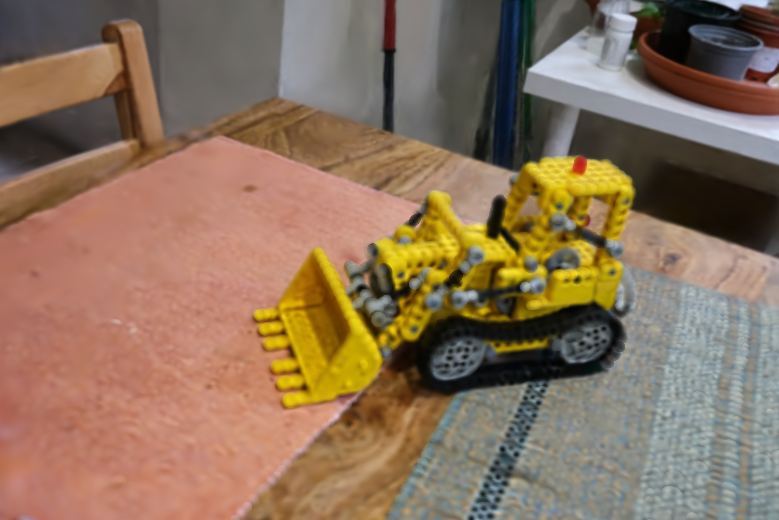
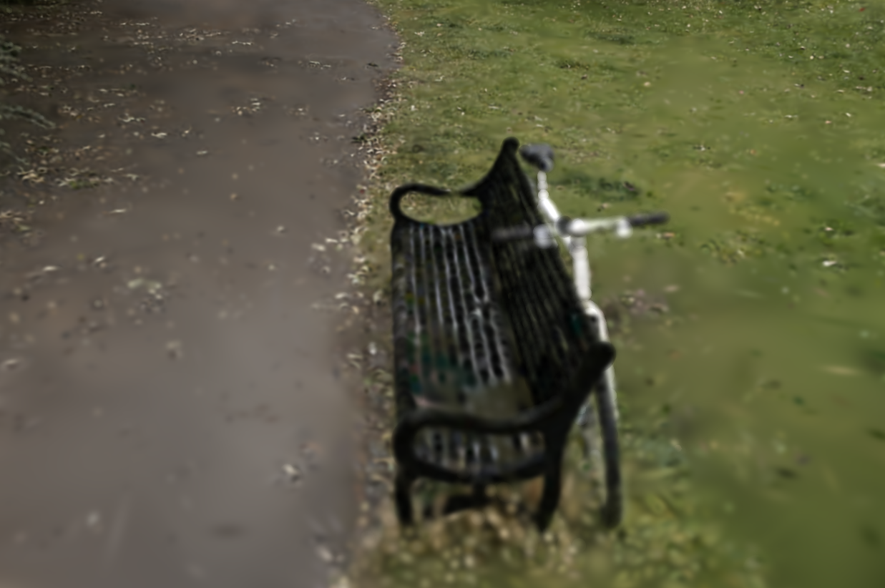

# 3D Gaussian Splatting on Apple Silicon

A from-scratch implementation of [3D Gaussian Splatting](https://repo-sam.inria.fr/fungraph/3d-gaussian-splatting/) (Kerbl et al., SIGGRAPH 2023) in Metal/C++ for macOS. This project implements the complete training pipeline, including tiled rasterization, differentiable rendering with analytical gradients, adaptive density control, and per-parameter Adam optimization, entirely on Apple Silicon GPUs.

**This is not a port or wrapper.** Every component (~9,300 lines of original C++/Metal) was implemented directly in Metal compute shaders and C++, without relying on PyTorch, CUDA, or any ML framework.

## Motivation

This project was undertaken as an exploratory deep-dive into 3D Gaussian Splatting, one of the most significant advances in neural rendering from 2023. Rather than using the official PyTorch/CUDA implementation, I chose to reimplement the entire pipeline from scratch in Metal to:

1. **Gain deep algorithmic understanding** of every component in the differentiable rendering pipeline
2. **Explore Apple Silicon for ML/graphics** workloads typically restricted to CUDA
3. **Develop systematic debugging intuition** for complex gradient-based optimization systems

## Results

### Kitchen Scene (MipNeRF360)

| Metric | This Implementation | Original 3DGS (CUDA) |
|--------|---------------------|----------------------|
| PSNR | 19.72 dB (mean) / **27.34 dB** (best) | ~31.6 dB (mean) |
| SSIM | 0.488 (mean) / **0.826** (best) | ~0.922 |
| LPIPS ↓ | 0.568 (mean) / **0.283** (best) | - |
| Final Loss | 0.0741 | - |
| Training Time | 142 min | ~6 min |
| Gaussians | 241,367 → 818,463 | - |



<details>
<summary>Kitchen Training Convergence</summary>

```
Training: 107 epochs (20,758 iterations) on 279 images
Optimizer: Adam with per-parameter learning rates

Loss progression:
        Epoch 0:   0.1579 (initial)
        Epoch 107: 0.0741 (final)

Opacity resets at iterations: 3000, 6000, 9000, 12000
Loss reduction: 53.1%
```

</details>

### Bicycle Scene (MipNeRF360)

| Metric | This Implementation | Original 3DGS (CUDA) |
|--------|---------------------|----------------------|
| PSNR | 14.96 dB (mean) / **22.92 dB** (best) | 25.25 dB (mean) |
| SSIM | 0.324 (mean) / **0.700** (best) | 0.771 |
| LPIPS ↓ | 0.753 (mean) / **0.395** (best) | - |
| Final Loss | 0.0984 | - |
| Training Time | 174 min | ~6 min |
| Gaussians | 54,275 → 2,983,570 | - |



<details>
<summary>Bicycle Training Convergence</summary>

```
Training: 155 epochs (30,070 iterations) on 194 images
Optimizer: Adam with per-parameter learning rates

Loss progression:
        Epoch 0:   0.2430 (initial)
        Epoch 155: 0.0984 (final)

Opacity resets at iterations: 3000, 6000, 9000, 12000
Loss reduction: 59.5%
```

</details>

### Understanding the Quality Gap

The gap between this implementation and the original is expected and provides insight into which components matter most for reconstruction quality:

1. **Spherical Harmonics Degree**: This implementation activates degree-1 SH (12 of the 48 stored coefficients) vs. degree-3 in the original. Higher-order SH captures view-dependent specular effects (e.g., reflections on the bicycle frame) that degree-1 cannot represent. This is the single largest contributor to the quality gap, particularly on the outdoor bicycle scene.

2. **Density Control Tuning**: The original's adaptive densification thresholds were calibrated against CUDA gradient magnitudes. Different gradient scales in this Metal implementation lead to suboptimal split/clone decisions, an area where scene-aware threshold scheduling would help.

3. **Hardware & Iteration Speed**: Training on an M1 Pro (174 min) vs. an RTX 3090 (~6 min) limits the number of hyperparameter iterations possible during development, compounding tuning differences.

The kitchen scene performs significantly better than the bicycle scene because it is an indoor scene with more diffuse surfaces, where degree-1 SH is sufficient to capture most of the appearance variation.

## Technical Implementation

### Architecture

```
COLMAP Sparse Reconstruction
            ↓
    Initialize Gaussians (position, SH, scale, rotation, opacity)
            ↓
    ┌───────────────────────────────────────┐
    │           Training Loop               │
    │  ┌─────────────────────────────────┐  │
    │  │ Forward Pass (tiled rasterizer) │  │
    │  │   • Project to 2D               │  │
    │  │   • Compute 2D covariance       │  │
    │  │   • Tile assignment + sort      │  │
    │  │   • Per-tile alpha blending     │  │
    │  └─────────────────────────────────┘  │
    │              ↓                        │
    │     L1 + D-SSIM Loss                  │
    │              ↓                        │
    │  ┌─────────────────────────────────┐  │
    │  │ Backward Pass (differentiable) │  │
    │  │   • Gradient through blending   │  │
    │  │   • Chain rule to Gaussians     │  │
    │  └─────────────────────────────────┘  │
    │              ↓                        │
    │     Adam Optimizer (per-param LR)     │
    │              ↓                        │
    │     Density Control (prune/split)     │
    └───────────────────────────────────────┘
            ↓
    Export PLY → Real-time Viewer
```

### Core Components

| Component | Description |
|-----------|-------------|
| **Tiled Rasterizer** | 16x16 tile-based rendering with front-to-back alpha blending. Each tile processes Gaussians independently for parallelism. |
| **GPU Radix Sort** | Metal provides no built-in sorting primitives (unlike CUDA's CUB library), requiring a custom 32-bit and 64-bit radix sort implementation. Keys encode (tile_id, depth) for correct front-to-back ordering within each tile. |
| **Differentiable Rendering** | Full backward pass computing analytical gradients w.r.t. position, covariance, color (SH coefficients), and opacity through the alpha-blending compositing operation, driven by combined L1 + D-SSIM per-pixel loss. |
| **Adaptive Density Control** | Clone small Gaussians in high-gradient regions, split large ones, prune low-opacity/oversized Gaussians. Periodic opacity resets prevent accumulation of semi-transparent Gaussians. |
| **Adam Optimizer** | GPU-based Adam with per-parameter learning rates for position, scale, rotation, color, and opacity. Includes first and second moment tracking with bias correction. |

### Key Implementation Details

**Spherical Harmonics**: The Gaussian data structure stores 48 SH coefficients (16 per RGB channel, supporting up to degree-3). Currently, degree-1 SH (12 coefficients: DC + 3 first-order directional terms per channel) is activated during training, providing basic view-dependent color. The data layout is forward-compatible with higher-order SH activation.

**Covariance Parameterization**: Gaussians store scale (log-space) and rotation (quaternion) separately. The 3D covariance is reconstructed as Sigma = RSS^TR^T, then projected to 2D via the Jacobian of the perspective projection for rendering.

**Activation Functions**:
- Opacity: `sigmoid(raw)` ensures [0,1] range
- Scale: `exp(log_scale)` ensures positive values
- Color: `SH_C0 * sh_color + 0.5` (direct linear path, see bug fix below)

## Technical Challenges & Solutions

### The Post-Reset Saturation Bug

**Problem**: After opacity resets (iterations 3000, 9000, 12000), rendered images showed severe color saturation. Whites became yellow, colors washed out. Loss would spike and slowly recover but never reach pre-reset quality.

**Investigation**:
1. Monitored SH coefficient magnitudes across training
2. Found DC coefficients (f_dc_0/1/2) growing unbounded after resets
3. Values reaching 10-50+ (should be ~[-2, 2] range)
4. The opacity reset was disrupting the learned color balance

**Root Cause**: When opacity resets to near-zero, Gaussians that previously contributed strongly suddenly don't. The optimizer compensates by pushing SH coefficients higher to maintain the same visual output, but this creates instability in the gradient flow.

**Solution**: Switched away from sigmoid-based color gradients and stabilized the color path:
```cpp
// In tiled_shaders.metal
float3 sh_color = evalSphericalHarmonics(sh_coeffs, view_dir);
float3 rgb = SH_C0 * sh_color + 0.5;
```

This removed the prior sigmoid-gradient behavior in color updates and improved training stability through opacity resets.

**Before Fix** | **After Fix**
:---:|:---:
 | 

### Other Challenges Overcome

1. **Custom Sorting for Metal**: Unlike CUDA's CUB library which provides optimized sorting primitives, Metal has no built-in sort. Implemented custom 32-bit and 64-bit radix sort pipelines with GPU execution in the tiled rasterizer plus CPU fallback paths for robustness.

2. **Gradient Numerical Stability**: Added epsilon terms to covariance inverse computation to prevent NaN gradients during backward pass through the 2D covariance projection.

3. **Memory Alignment**: Metal requires specific alignment for buffer structs. Gaussian struct padded to 256 bytes for efficient GPU access patterns across thousands of concurrent threads.

4. **Depth Ordering Artifacts**: Implemented proper front-to-back compositing with premultiplied alpha to eliminate ordering artifacts at tile boundaries.

## Performance

| Stage | Time |
|-------|------|
| **Training Iteration** | ~348 ms |
| Sort (GPU, sampled from logs) | ~10-14 ms |
| Range+Render (GPU, sampled from logs) | ~5-8 ms |

*Measured on Apple M1 Pro with 16GB unified memory.*

Training is slower than the original CUDA implementation due to Metal's lack of mature sorting infrastructure, lower memory bandwidth of unified memory compared to dedicated VRAM, and Metal compute shader occupancy tuning differences from CUDA.

## Building & Running

### Requirements
- macOS 13+ (Ventura or later)
- Xcode 14+
- GLFW (`brew install glfw`)

### Build
```bash
xcodebuild -project GaussianSplatting.xcodeproj -scheme GaussianSplatting
```

### Training
```bash
./build/GaussianSplatting \
    --colmap /path/to/sparse/0/ \
    --images /path/to/images/ \
    --output trained.ply \
    --epochs 155
```

### Viewing
```bash
./build/GaussianSplatting --view trained.ply
```

## Datasets

Results generated using scenes from the [MipNeRF 360 dataset](https://jonbarron.info/mipnerf360/):

- **Kitchen**: 279 training images at 1/4 resolution. Indoor scene with diffuse surfaces and structured geometry.
- **Bicycle**: 194 training images at 1/4 resolution. Complex outdoor scene with foliage, specular surfaces (bike frame), and fine detail.

## What I Learned

This project developed skills directly applicable to computer vision research:

### Technical Skills
- **GPU Programming**: Deep experience with Metal compute shaders, memory management, and parallel algorithm design
- **Differentiable Rendering**: Implementing backward passes through complex rendering pipelines with proper gradient flow and chain rule application
- **3D Vision Fundamentals**: Camera models, projective geometry, covariance transformations, spherical harmonics
- **Optimization**: Adam optimizer implementation, per-parameter learning rates, gradient clipping strategies

### Research Skills
- **Systematic Debugging**: The post-reset SH saturation bug required methodical investigation: logging metrics, visualizing intermediate outputs, forming and testing hypotheses
- **Reading Research Code**: Translating the original CUDA implementation's conventions to Metal required understanding undocumented assumptions in the reference codebase
- **Ablation Mentality**: When quality was poor, I learned to isolate components (disable density control, freeze certain parameters) to identify the cause, a core skill for diagnosing issues in complex ML systems

## Future Work

- [ ] Activate degree-3 spherical harmonics for full view-dependent specular effects
- [ ] Implement scene-aware density control with adaptive thresholds and schedules
- [ ] Add edge-aware reconstruction loss with gradients through forward/backward passes
- [ ] Add anti-aliasing (EWA splatting) for distant Gaussians
- [ ] Profile and optimize Metal shader occupancy and thread group sizing

<details>
<summary>Limitations</summary>

- **Spherical Harmonics**: Only degree-1 SH is activated (degree-3 data structure is in place but not yet used in training)
- **Anti-aliasing / EWA splatting**: No mip-mapping for distant Gaussians
- **Exposure compensation**: Fixed exposure across training views
- **Background modeling**: Assumes white background (no sky dome)
- **Multi-resolution training**: Single resolution only
- **Batch processing**: Single image per iteration

</details>

## References

- Kerbl et al., "3D Gaussian Splatting for Real-Time Radiance Field Rendering", SIGGRAPH 2023
- [Original Implementation (CUDA)](https://github.com/graphdeco-inria/gaussian-splatting)
- [MipNeRF 360 Dataset](https://jonbarron.info/mipnerf360/)

## License

This implementation is for educational and research purposes.
